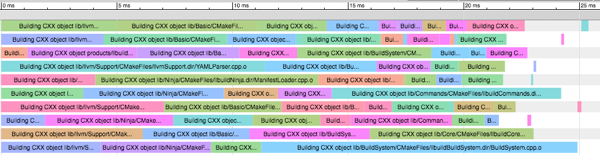

llbuild
=======

*A low-level build system.*

**llbuild** is a set of libraries for building build systems. Unlike most build
system projects which focus on the syntax for describing the build, llbuild is
designed around a reusable, flexible, and scalable general purpose *build
engine* capable of solving many "build system"-like problems. The project also
includes additional libraries on top of that engine which provide support for
constructing *bespoke* build systems (like `swift build`) or for building from
Ninja manifests.

llbuild currently includes:

- [x] A flexible core engine capable of discovering new work on the fly.

- [x] Scalability for dependency graphs reaching millions of nodes.

- [x] Support for building Ninja manifests (e.g., for building LLVM, Clang, and
  Swift).

- [x] An llbuild-native build description format designed for extensibility.

- [x] Library-based design intended to support embedding and reuse.


Usage
-----

The project currently produces three top-level products; `llbuild`, `swift-build-tool`,
and `libllbuild` / `llbuild.framework`.

### `llbuild` Command Line Tool

The `llbuild` tool provides a command line interface to various feature of the
llbuild libraries. It has several subtools available, see `llbuild --help` for
more information. The most important subtool is the Ninja build support:

#### Ninja Build Support

You can use `llbuild` to build Ninja-based projects using:

```shell
$ llbuild ninja build
```

This tool supports a subset of the command line arguments supported by Ninja
itself, to allow it to be used as a compatible replacement, even by tools like
CMake that depend on particular Ninja command line flags during their
configuration process.

As a convenience, if you invoke `llbuild` via a symlink called `ninja` then it
will automatically use this subtool. This supports installing llbuild as `ninja`
into your `PATH` and then using it as an alternative to Ninja for building
arbitrary projects (like LLVM, Clang, and Swift). This is also how we self-host
`llbuild` (via the CMake Ninja generator).

The `llbuild ninja` subtool also provides additional commands which are
primarily only useful for developers interested in working on the Ninja
support. These commands allow testing the lexer, parser, and manifest loading
components independently and are used as part of the test suite.

#### Build Trace Files

Inspired by Buck, `llbuild ninja` supports a `--profile PATH` option to generate
a
[Chromium trace](https://www.chromium.org/developers/how-tos/trace-event-profiling-tool) for
visualizing where time is spent during a build. For example, the following graph
is for a build of llbuild itself:



### `swift-build-tool` Command Line Tool

The `swift-build-tool` product is the command line interface to the build system
used by the [Swift Package Manager](https://swift.org/package-manager/). It is
built as part of the [Swift](https://swift.org) project build and incorporated
into the Swift language snapshots.

This tool is built on top of the [BuildSystem](docs/buildsystem.rst) library.

### `libllbuild` Library

The `libllbuild` library exposes a C API for the llbuild libraries, which can be
used directly by third-parties or to build additional language bindings. See
[bindings](bindings/) for example Swift and Python bindings that use this
library.

This API is what is used, for example, in Xcode as the basis for the new build
system introduced in Xcode 9.


Motivation
----------

The design of llbuild is a continuation of the LLVM philosophy of applying
library-based design to traditional developer tools.
[Clang](http://clang.llvm.org) has followed this approach to deliver a high
performance compiler and assembler while also enabling new tools like
clang-format or the libclang interfaces for code completion and
indexing. However, the rigid command line interface between traditional build
systems and the compiler still limits the optimizations and features which can
be implemented in Clang.

llbuild is designed to allow construction of more feature rich build
environments which integrate external tools -- like the compiler -- using APIs
instead of command line interfaces. By allowing the build system and tools to
communicate directly and to be co-designed, we believe we can unlock additional
optimization opportunities and create more robust, easy-to-use build systems.

For more information, see
[A New Architecture for Building Software](https://www.youtube.com/watch?v=b_T-eCToX1I)
from the 2016 LLVM Developer's Conference.


Philosophy
----------

In the abstract, build systems are used to perform a task while also being:

* Incremental: Outputs should be efficiently rebuilt given a small change to the
  inputs, by leveraging the ability to save partial outputs from a prior build.

* Consistent: Equivalent inputs should always produce the same result as building from clean.
  
* Persistent: Results should be stored so that builds can be interrupted and
  resumed after failure without needing to redo the full computation.

* Parallel & Efficient: It must be possible to perform independent elements of
  the computation in parallel, in order to compute the result as efficiently as
  possible.

When viewed in this light, it is clear that the core technology of a build
system is applicable to any complex, long-running computation in which it is
common for the user to only modify a small portion of the input before wanting
the recompute the result. For example, a movie editor application will commonly
need to rerender small portions of the overall movie in response to interactive
edits in order to support preview of the final result. However, such
applications frequently do not take full advantage of the ability to store and
partially recompute the results because of the complexity of correctly managing
the dependencies between parts of the computation.

Part of the goal in designing llbuild around a general purpose build engine is
to allow its use in contexts which are not traditionally thought of as requiring
a "build system".


Documentation
-------------

Technical documentation is available at
[llbuild.readthedocs.io](https://llbuild.readthedocs.io).


Bug Reports
-----------

Bug reports should be filed in the [Swift OSS Jira](https://bugs.swift.org) in
the `llbuild` component.


Open Projects
-------------

llbuild is a work in progress. Some of the more significant open projects which
we hope to tackle are:

- [ ] Support for using file signatures instead of timestamps for change detection.

- [ ] Support richer data types for communication between tasks.

  Tasks currently only compute a single scalar value as their result. We
  would like to support richer data types for tasks results, for example tasks
  should be able to compute sets of results, and have the engine automatically
  communicate the addition or removal of individual items in the set to
  downstream consumers.

- [ ] Support a more sophisticated database implementation.

  The current implementation uses a SQLite3 database for storing build
  results. This was a pragmatic choice for bring up, but it can be a performance
  bottleneck for some applications, and we do not need the flexibility of a full
  SQL database. We would like to evaluate the tradeoffs of designing a custom
  solution for llbuild.

- [ ] Support transparent distributed builds.

  We would like llbuild to have facilities for transparently distributing a
  build across an array of worker machines.

- [ ] Support automatic auditing of build consistency.

  Few build systems diagnose problems effectively. Frequently, undeclared inputs
  or misbehaving tools can cause inconsistent build results. We would like
  llbuild to automatically diagnose these problems, for example by periodically or
  speculatively rebuilding items which are not expected to have changed and
  comparing the results.

- [ ] Performance tuning of core engine queues.

  The core build engine does its work using a number of queues of work items,
  and locking for the subset which support concurrent manipulation. We would
  like to investigate moving the shared queues to using a lock-free data
  structure and to micro-optimize the queues in general, in order to support
  very fine-grained task subdivisions without negatively impacting performance.


FAQ
---

*Q. Why does llbuild include some parts of LLVM?*

A. As a low-level, embeddable component, we want llbuild itself to have a
simple build process without any significant build time dependencies. However,
we also wanted to take advantage of some of the data structures and support
facilities that have been developed for LLVM. For now, our solution is to
incorporate some parts of LLVM's Support libraries into the repository, with the
hope that over time LLVM will either factor out those libraries in a way that
makes it easier to reuse them, or that we will develop our own exclusive set of
support data structures and utilities and drop use of the LLVM ones.

*Q. Why does llbuild include [Ninja](https://ninja-build.org) support?*

A. llbuild includes a Ninja compatibility layer which allows building projects
which use Ninja manifests using the llbuild core engine. We developed this
support as a proof of concept for the core engine, and as a way to bootstrap
ourselves (we develop llbuild using the CMake Ninja generator and llbuild to
build itself). This support is also valuable for allowing direct benchmarking
comparisons of llbuild.

Our implementation of Ninja support also includes a separate library for
programmatically loading Ninja manifests, which may prove useful to other
projects wishing to use or manipulate Ninja files.

We intend to continue to maintain the Ninja support to keep compatibility with
the main project.


Acknowledgements
----------------

llbuild is heavily influenced by modern build systems like
[Shake](http://shakebuild.com), [Buck](https://buckbuild.com), and
[Ninja](https://ninja-build.org). We would particularly like to thank Neil
Mitchell for his work describing the Shake algorithm which provided the
inspiration for the mechanism llbuild uses to allow additional work to be
discovered on the fly.

For similar projects, see [Adapton](http://adapton.org/)
and [Salsa](https://github.com/salsa-rs/salsa).


License
-------

Copyright (c) 2014 - 2019 Apple Inc. and the Swift project authors.
Licensed under Apache License v2.0 with Runtime Library Exception.

See http://swift.org/LICENSE.txt for license information.

See http://swift.org/CONTRIBUTORS.txt for Swift project authors.
