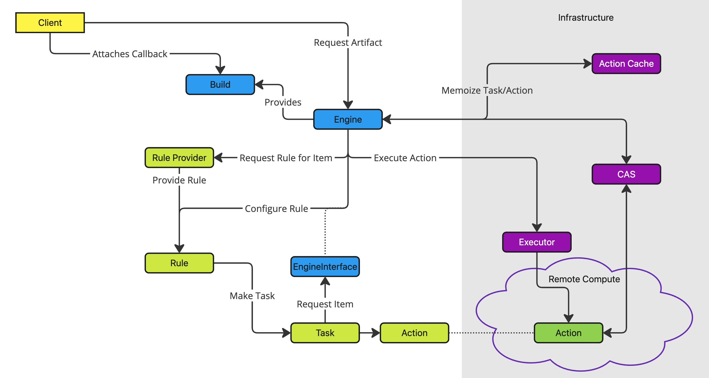

# Tritium — llbuild3

## Objectives

* Improve graph definition ergonomics
    * (Re-)add an intrinsic artifact object, separate from producing rules
    * Incremental computation of rules in addition to graphs
        * Support dynamically down-scoping rule cache keys
* Enable larger scale graphs
    * Recursive engine inter-operability
        * Engine as artifact/rule provider
        * Fully serializable, cache-able engine state
    * Separate and finely control engine parallelism and task scheduling from networking (remove SwiftNIO/Futures use from the core)
    * Improve engine resumption performance
        * Ability to reconnect to in progress actions
* Facilitate build graph unification
    * API adapters/compatibility/on-ramp for existing llbuild and llbuild2fx use cases

## API Overview — Ergonomics

Tritium will incorporate concepts from llbuild1, llbuild2, and llbuild2fx.  The constructs are intended to enable a separation of the items that can be produced (Artifacts) from the computations that can produce them (Rules/Tasks), addressing an expression challenge that exists today in llbuild2fx rule definition.

### Dynamic Graph Definition

* Labels
    * Hierarchical naming construct used for uniquely identifying items within a build namespace
* Artifacts
    * Named items that can be used and produced within and from a build
    * Artifacts have concrete types:
        * File
        * Directory/File-tree
        * Blob
        * Dictionary
        * List
    * Can be stored “inline”, or represented as CAS objects
* Rules
    * A named individual element of computation that can be configured by the engine to produce one or more artifacts
    * Can be abstract, producing a generic set of artifacts that may depend upon details of a configuration context
* Rule Providers
    * Own specific rule and artifact label prefixes
    * Responsible for constructing rule instances when requested by the engine
* Tasks
    * Concrete in-progress computations tracked by the engine that may request inputs, actions, and ultimately produces output artifacts
    * Constructed by rules given a specific configuration context by the engine
    * Intrinsically representable as functional state machine with serializable task contexts 
        * Can asynchronously request inputs
* Actions
    * Discrete async/parallelizable computations with defined inputs and outputs
    * Properties may include
        * Functional, cache-able
        * Distributable
        * Require a specified computation environment
* Build
    * Outstanding, in-progress request to produce a specific artifact from the overall build namespace

### Engine Components

* Action Cache
    * Persistent data structure for memoizing task state transitions and action computations
* Executor
    * Interface for performing action computations
    * Asynchronous, actions may be remote, distributed

## Graph Scale, Engine Performance

Overall goal is to support large operating system scale, multi-project build graphs where fine-grained (individual compile actions or smaller) incremental computation can be performed across thousands of high level projects.

Expected Strategies

* Recursive engine coordination
    * Entire sub-graphs can be represented as nodes within a parent graph
        * Own specific artifact/rule prefixes within the larger graph
        * Can request artifacts outside of the current graph for resolution by parent graph
    * Whole engine state that can be serialized and cached for incremental resumption based on requested external inputs
    * Sub-graphs/engines that can, under certain circumstances be distributed for remote execution
* Engine control of task/action execution parallelism and priority
    * Separation of engine threads from networking
    * Graph state introspection
    * Defined, serializable, cache-able execution state transitions
    * Graph-aware task scheduling
* Resume-able Actions
    * Defined API for reconnecting/de-duplicating in-flight action computations within the executor

## Build System Layer Unification/Fusing

The existing ecosystem of llbuild clients have well-tested, reliable implementations of build rules that cover low-level project definitions and higher level multi-project OS relationships.  As much as practical, the goal is to provide an incremental path for these existing clients.  Although the major benefits in expressivity come from adoption of the new API constructs, providing adapters should enable a smoother on-ramp for existing services and offer the potential for earlier interoperability.

## Implementation Strategy

* Evolve existing llbuild graph execution engine core
* Evolve llbuild2 protobuf data structures for engine protocol and state
* Provide fully Swift-async native API interface for clients

What exists today

* Swift XCTest exercising core engine functionality
* First pass protobuf specs representing engine and task state
* Integration of data structures with the graph execution core
* Working basic, multi-node graph computation using rules, providers that instantiate tasks and produce artifacts
* Bootstrap initialization support enabling dynamic provider registration

Next steps

* Action cache integration
* Executor integration

Code Structure

* Framework Headers
    * products/Tritium
* Framework Sources
    * src/tritium
* Unit Tests
    * unittests/TritiumCoreTests
